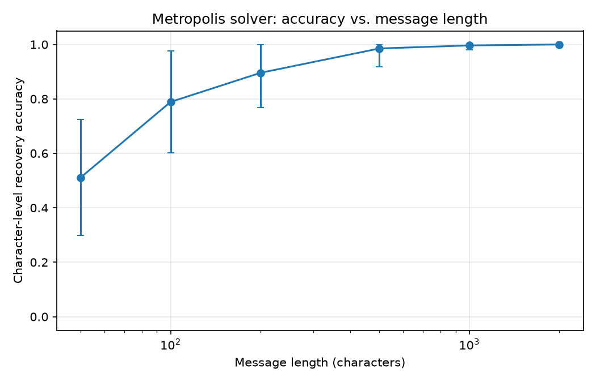
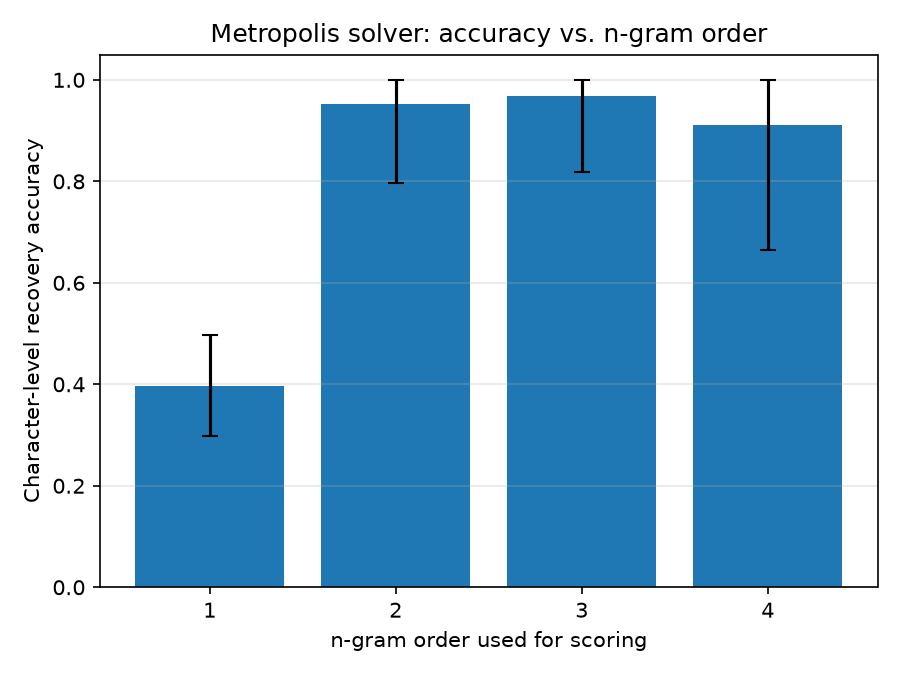
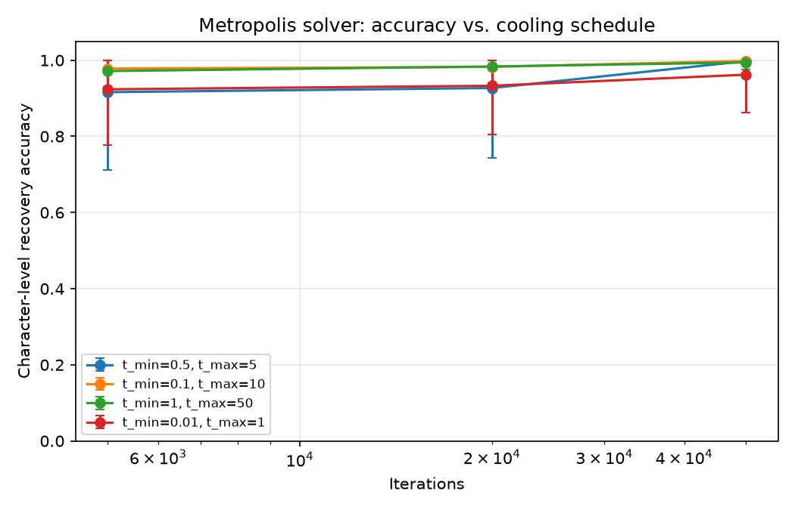
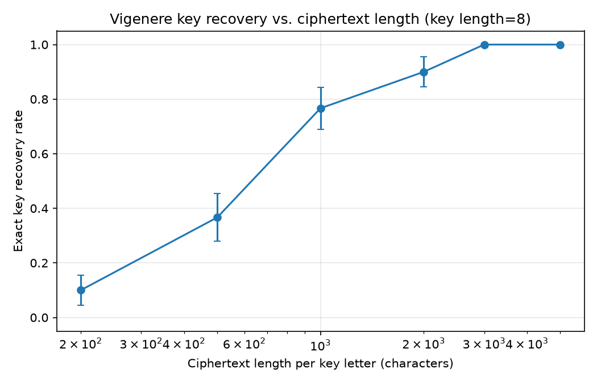
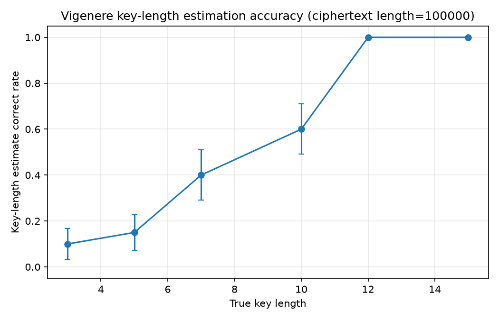
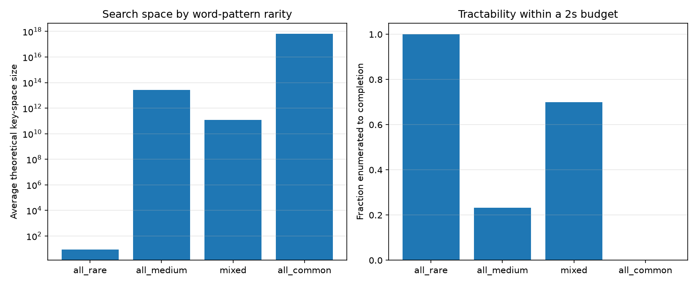

# annealing-cryptanalysis

A statistical cryptanalysis toolkit: classical ciphers broken with n-gram
frequency modelling, a simulated-annealing (Metropolis algorithm) solver,
a word-pattern dictionary attack, and index-of-coincidence-based Vigenere
cracking. Includes a tested library, a benchmark suite that measures where
each technique actually holds up, and a marimo notebook walking through all
of it.

## What's here

- **`src/codebreak/`** - the library
  - `alphabet` - text loading/cleaning
  - `ngrams` - n-gram frequency modelling and log-likelihood scoring
  - `substitution` - cyclic (Caesar) and general substitution ciphers, unigram frequency attack
  - `metropolis` - simulated-annealing solver for substitution ciphers
  - `wordpatterns` - word-pattern dictionary attack for short messages
  - `transposition` - columnar transposition cipher
  - `vigenere` - Vigenere cipher and index-of-coincidence cryptanalysis
- **`tests/`** - pytest suite covering correctness and known failure modes of each technique
- **`benchmarks/`** - scripts that measure recovery accuracy/tractability across many trials (see [Results](#results) below)
- **`demo.py`** - a [marimo](https://marimo.io) notebook demonstrating the whole toolkit
- **`texts/`** - public-domain reference corpora (Moby Dick, the Sherlock Holmes stories, War and Peace, Le Comte de Monte-Cristo) and a 10,000-word English list, used for frequency modelling and dictionary attacks

## Quickstart

This project uses a Nix flake for its dev environment (Python, numpy,
matplotlib, pytest, marimo):

```sh
direnv allow      # or: nix develop
pytest            # run the test suite
marimo edit demo.py   # open the interactive demo
```

Without Nix, any Python >=3.11 environment works:

```sh
pip install -e .[dev]
pytest
```

## Results

Each benchmark runs many random trials per condition (not just one) so the
numbers below are averages, not anecdotes. Run them yourself with:

```sh
python3 benchmarks/bench_substitution.py [--quick]
python3 benchmarks/bench_vigenere.py [--quick]
python3 benchmarks/bench_wordpatterns.py [--quick]
```

`--quick` runs a fast, low-trial-count sanity check (a couple of minutes
total); the default is the full sweep (~8 minutes total). Results are written
to `benchmarks/results/` as CSVs and PNGs.

### Substitution ciphers (Metropolis algorithm)



Recovery accuracy climbs from 51% at 50 characters to 100% by 2000, with
diminishing returns after ~500 characters (25 trials per length):

| Length (chars) | 50 | 100 | 200 | 500 | 1000 | 2000 |
|---|---|---|---|---|---|---|
| Accuracy | 0.511 | 0.789 | 0.896 | 0.985 | 0.996 | 1.000 |



Scoring against unigram frequencies alone barely beats random guessing once
the initial frequency-matching guess needs refining (40% accuracy); any
higher-order model does far better, with bigrams already capturing most of
the benefit. Tetragrams have the highest variance (±0.25) despite a similar
mean to bigrams/trigrams - sparser 4-gram statistics occasionally send the
solver the wrong way:

| n-gram order | 1 | 2 | 3 | 4 |
|---|---|---|---|---|
| Accuracy | 0.398 | 0.953 | 0.968 | 0.911 |



Cooling schedule matters most at low iteration counts - by 50,000 iterations
all four (t_min, t_max) configurations tested converge to 96-100% accuracy
regardless of schedule.

### Vigenere cipher



Key recovery (fixed 8-letter key) needs real data per key letter: 10% success
at 200 characters/letter, 100% by 3000:

| Chars per key letter | 200 | 500 | 1000 | 2000 | 3000 | 5000 |
|---|---|---|---|---|---|---|
| Exact key recovery rate | 0.10 | 0.37 | 0.77 | 0.90 | 1.00 | 1.00 |



Key-length estimation (via index of coincidence) is markedly less reliable
for short keys - shorter periods have more harmonics competing inside the
search window, so the estimator more easily locks onto a multiple of the
true length instead of the length itself:

| True key length | 3 | 5 | 7 | 10 | 12 | 15 |
|---|---|---|---|---|---|---|
| Estimate correct rate | 0.10 | 0.15 | 0.40 | 0.60 | 1.00 | 1.00 |

### Word-pattern dictionary attack



How much word-pattern matching narrows the key space depends entirely on how
common the matched words' letter-repetition patterns are. A phrase built from
rare-pattern words (e.g. `LITTLE`, pattern `0.1.2.2.0.3`) resolves to a search
space of ~9 keys and finishes essentially instantly. A phrase built from
common-pattern words (e.g. `CAT`, pattern `0.1.2`, shared by hundreds of
dictionary words) can have a search space around 10^17 - given a fixed 2-second
budget per attempt, that condition never finished enumerating in any of 30
trials:

| Word patterns | avg. search space | completed within 2s |
|---|---|---|
| all rare | 9 | 100% |
| mixed | 1.2 x 10^11 | 70% |
| all medium | 2.7 x 10^13 | 23% |
| all common | 6.5 x 10^17 | 0% |

## License

MIT - see [LICENSE](LICENSE).
